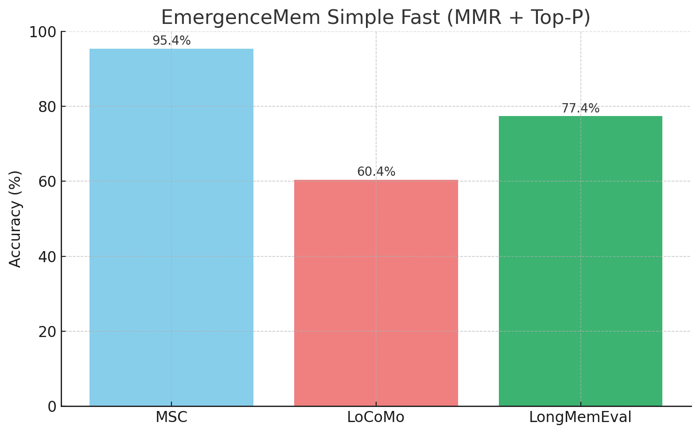
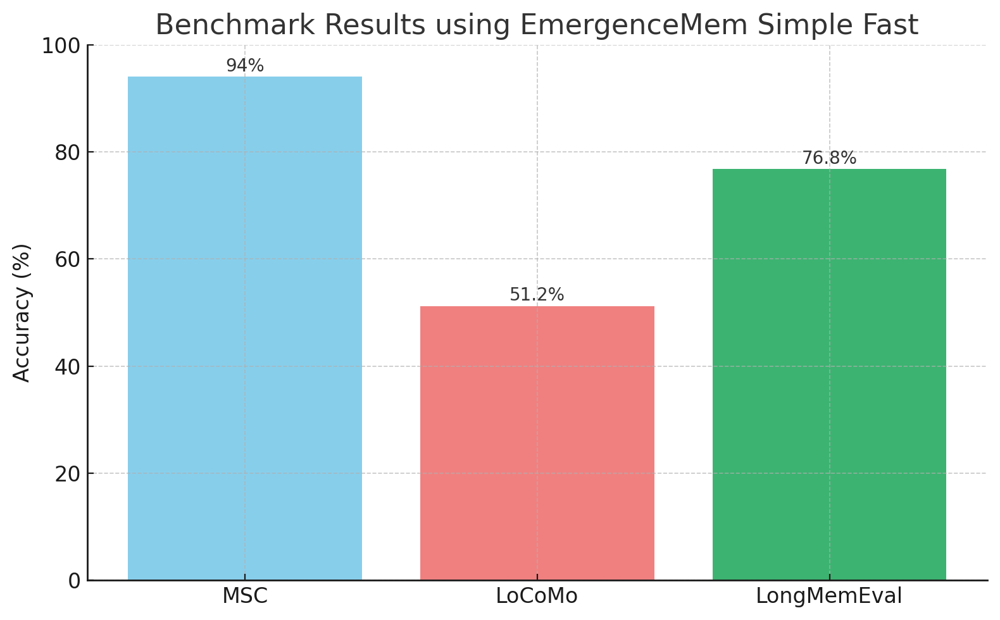
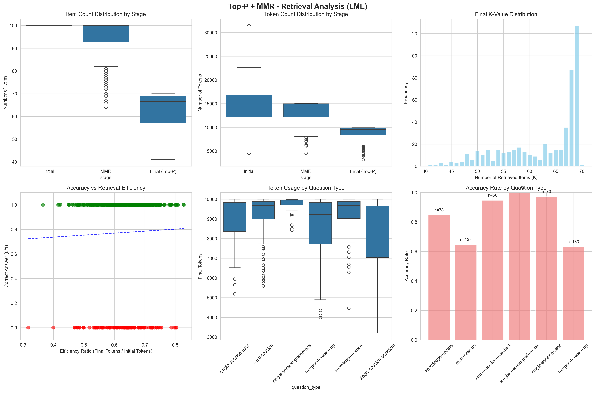

# Adaptive RAG for Memory Benchmarks (Enhanced)

An enhanced fork of [Emergence AI's emergence_simple_fast](https://github.com/EmergenceAI/emergence_simple_fast) repository, featuring **adaptive retrieval with MMR + Top-P** to replace traditional fixed Top-K approaches. This implementation provides more adaptive, chunk-size and dataset-independent retrieval for long-term memory evaluation across multiple benchmark datasets.

## 🔧 Key Improvements Over Original

### Enhanced Retrieval Pipeline
- **MMR + Top-P Adaptive Retrieval**: Replaces fixed Top-K with Maximum Marginal Relevance (λ=0.65) + Top-P nucleus sampling (p=0.7)
- **Token-aware Selection**: Intelligent token budgeting with 15k→10k token limits across pipeline stages
- **Multi-stage Filtering**: Initial retrieval → MMR diversity → Top-P quality refinement

### Expanded Dataset Support
- **LongMemEval (LME)**: Original factual memory evaluation dataset
- **MSC**: Multiple-choice Situation Comprehension 
- **LoCoMo**: Long Conversation Memory benchmarks

### Enhanced Analysis & Visualization
- Comprehensive retrieval statistics and efficiency analysis
- Multi-panel visualizations showing token usage, K-distribution, and accuracy patterns
- Question-type performance breakdown with statistical insights

## 📊 Performance Results

Our adaptive MMR + Top-P approach achieves strong performance across all datasets:





- **MSC**: 95.4% accuracy (vs 94% baseline)
- **LoCoMo**: 60.4% accuracy (vs 51.2% baseline) 
- **LongMemEval**: 77.4% accuracy (vs 76.8% baseline)

### Adaptive Retrieval Pipeline Visualization


The pipeline progressively refines from 100 initial candidates → 80 diverse items (MMR) → 60 high-quality items (Top-P) → 50 final selections, optimizing both relevance and diversity while respecting token constraints.

### Detailed Analysis Dashboard



Comprehensive analysis showing:
- **Token efficiency**: 50-80% reduction from initial to final retrieval
- **K-distribution**: Adaptive selection vs fixed Top-K
- **Question-type performance**: Accuracy patterns across different memory tasks
- **Efficiency vs Accuracy**: Correlation between retrieval optimization and performance

## 💰 Cost Comparison

⚠️ **Important Cost Notice:**

- **Original approach** (`main_original.py`): ~$1.40 USD for full LongMemEval dataset
- **Enhanced approach** (`main.py`): ~$1.99 USD for full LongMemEval dataset
  
The 42% cost increase reflects the more sophisticated multi-stage retrieval process and comprehensive analysis features. Consider using `--num_samples` for testing or budget-conscious runs.

## 🚀 Quick Start

### 1. Environment Setup
```bash
git clone https://github.com/[your-username]/emergence_simple_fast.git
cd emergence_simple_fast
pip install -r requirements.txt
```

### 2. API Configuration
```bash
export OPENAI_API_KEY=your-api-key-here
```

### 3. Dataset Preparation
```bash
mkdir data
# Download LongMemEval dataset following instructions from:
# https://github.com/xiaowu0162/LongMemEval
# Place longmemeval_s.json in the data/ directory
```

### 4. Run Benchmarks

**Enhanced Adaptive Retrieval (Recommended):**
```bash
# LongMemEval with adaptive MMR + Top-P
python main.py lme --adaptive-k --num_samples 50

# MSC with adaptive retrieval  
python main.py msc --adaptive-k --num_samples 20

# LoCoMo with standard fixed Top-K
python main.py locomo --num_samples 15
```

**Original Method (for comparison):**
```bash
python main_original.py
```

## 📋 Advanced Usage

### Retrieval Method Comparison
```bash
# Fixed Top-K (original approach)
python main.py lme --num_samples 100

# Adaptive MMR + Top-P (enhanced approach)  
python main.py lme --adaptive-k --num_samples 100
```

### Dataset-Specific Options
```bash
# LME with question type filtering
python main.py lme --question-types single-session-user multi-session --adaptive-k

# Full dataset processing (cost: ~$2 USD)
python main.py lme --load-all --adaptive-k

# Resume interrupted runs
python main.py lme --resume results/results_lme_20240801_142037.json
```

### Analysis and Debugging
```bash
# Detailed logging and analysis
python main.py lme --adaptive-k --log_level DEBUG --num_samples 20

# Custom output directory
python main.py lme --adaptive-k --output_dir my_results/
```

## 🏗️ Architecture

### Core Processing Pipeline
1. **Embedding Generation**: `all-MiniLM-L6-v2` sentence transformer
2. **Adaptive Retrieval**: MMR-based diversity + Top-P quality filtering
3. **Fact Extraction**: GPT-4o-mini structured fact extraction
4. **Multiple Choice QA**: Fact + context integration for answer selection

### Enhanced Retrieval Flow
```
Initial Semantic Search (100 candidates)
         ↓
MMR Diversity Filtering (λ=0.65, 15k tokens) 
         ↓
Top-P Quality Refinement (p=0.7, 10k tokens)
         ↓
Final Context Selection (~50 items)
```

### Dataset Configurations
- **LME**: 42 default Top-K, supports question type filtering
- **MSC**: 15 default Top-K, conversation comprehension tasks  
- **LoCoMo**: 50 default Top-K, long conversation memory

## 📈 Analysis Features

### Automatic Visualizations
- Token usage efficiency across pipeline stages
- K-value distribution patterns  
- Question-type performance breakdown
- Accuracy vs retrieval efficiency correlation

### Comprehensive Logging
- Per-question retrieval statistics
- Pipeline constraint analysis (token limits vs thresholds)
- Timing and cost tracking
- Resumable processing with intermediate saves

## 🛠️ Requirements

**Core Dependencies:**
- `sentence-transformers`: Embedding generation
- `openai`: GPT API integration  
- `datasets`: HuggingFace dataset loading
- `pandas`, `seaborn`, `matplotlib`: Analysis and visualization
- `torch`: PyTorch backend for embeddings

**Full requirements:** See `requirements.txt` for complete dependency list.

## 📁 Output Structure

Results are automatically organized in the `results/` directory:
```
results/
├── results_lme_20240801_142037.json      # Question results & accuracy
├── timing_lme_20240801_142037.json       # Performance timing data  
├── k_distribution_lme_20240801_142037.json # Retrieval statistics
├── retrieval_analysis_lme_20240801_142037.png # Visualization dashboard
└── run_lme_20240801_142037.log           # Detailed execution logs
```

## 🔬 Methodology

### MMR + Top-P Advantages
- **Diversity**: MMR prevents redundant context selection
- **Quality**: Top-P ensures high-relevance final candidates
- **Adaptivity**: Token-aware selection adapts to content density
- **Robustness**: Less sensitive to dataset-specific chunk sizes

### Evaluation Approach  
- **Multiple Choice**: Direct answer selection (no AI judge needed)
- **Cross-dataset**: Unified interface across LME, MSC, and LoCoMo
- **Comprehensive Metrics**: Accuracy, efficiency, and token utilization analysis

## 📚 Citation & Acknowledgments

This work builds upon:
- [Emergence AI's emergence_simple_fast](https://github.com/EmergenceAI/emergence_simple_fast)
- [LongMemEval Benchmark](https://github.com/xiaowu0162/LongMemEval)

## 📄 License

This project maintains the same license as the original emergence_simple_fast repository.